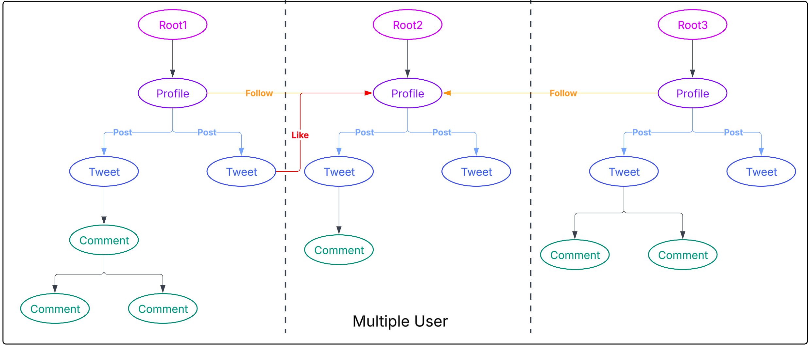

# LittleX: A Minimalistic Social Media Platform Prototype

LittleX is a lightweight social media application developed using the **Jaseci Stack**. It serves as a demonstration of how Jaseci Stack can be utilized to build scalable and intelligent applications.

## **About LittleX**

LittleX is a minimalistic implementation of a **social media platform** that showcases the capabilities of the Jaseci Stack. It includes features such as:

1. **User Profiles**:
   - Create and manage user accounts.
   - Follow other users and track relationships.

2. **Tweets**:
   - Post, view, and interact with tweets.

3. **Comments and Likes**:
   - Engage with tweets through comments and likes.

4. **AI-Powered Features**:
   - Utilizes **MTLLM** for GPT-4o summarization and SentenceTransformer for semantic search, enhancing user interactions.

5. **Cloud Deployment**:
   - Deploy workflows, walkers, and AI features to **Jac Cloud** for seamless scaling and execution.

## **LittleX Architecture**




## **Running LittleX on Local Environment**

**Prerequisites:** Python 3, Node.js, and [Jaseci](https://github.com/Jaseci-Labs/jaseci) (`pip install jaclang` and `jac serve` available).

### 1. Get the code

Either clone the LittleX repo:

```bash
git clone https://github.com/Jaseci-Labs/littleX.git
cd littlex
```

Or use the `littleX` folder from a parent repository (e.g. from repo root):

```bash
cd /path/to/parent-repo   # e.g. voipy
# All paths below use littleX/... when inside a parent repo
```

### 2. Install dependencies

From the **LittleX repo root** (or from the parent repo root, using `littleX/` prefixes):

```bash
pip install -r littleX_BE/requirements.txt
```

If LittleX is inside another repo:

```bash
pip install -r littleX/littleX_BE/requirements.txt
```

### 3. (Optional) Backend environment

For cloud/LLM features, set your API key:

```bash
cp littleX_BE/.env.example littleX_BE/.env
# Edit .env and set GEMINI_API_KEY (or other keys) as needed
```

If LittleX is inside another repo, use `littleX/littleX_BE/.env.example` and `littleX/littleX_BE/.env`.

### 4. Start the backend server

In one terminal, from the repo root:

```bash
jac serve littleX_BE/littleX.jac
```

If LittleX is inside another repo:

```bash
jac serve littleX/littleX_BE/littleX.jac
```

Keep this terminal open. Note the URL (e.g. `http://localhost:8000`).

### 5. Run the frontend

In a **second terminal**, from the repo root:

```bash
cd littleX_FE
npm i
npm run dev
```

If LittleX is inside another repo:

```bash
cd littleX/littleX_FE
npm i
npm run dev
```

Open the URL shown (e.g. `http://localhost:3000`). Use the app with the backend running in the other terminal.

### If the frontend (`littleX_FE`) is missing

If `littleX_FE` is empty or only has a `.next` folder, restore it from the upstream repo:

```bash
git clone --depth 1 https://github.com/Jaseci-Labs/littleX.git /tmp/littleX-upstream
rsync -a --exclude='.next' --exclude='node_modules' /tmp/littleX-upstream/littleX_FE/ littleX/littleX_FE/
```

Then run `npm i` and `npm run dev` from `littleX_FE` as in step 5.
