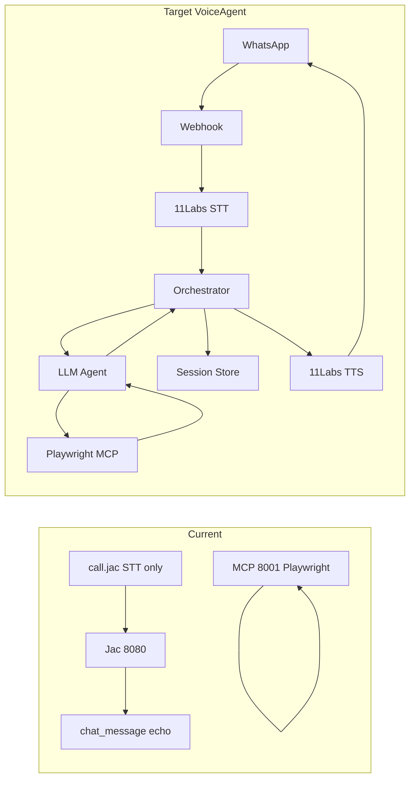

# VoiceAgent MVP — What's Left to Implement

## Current State vs PRD

| PRD Component                     | Current state                                                                                                                                                                                |
| --------------------------------- | -------------------------------------------------------------------------------------------------------------------------------------------------------------------------------------------- |
| **Voice I/O (11Labs + WhatsApp)** | 11Labs STT only in standalone [call.jac](littleX_FULLSTACK/call.jac) (local recording → S3). No WhatsApp, no webhooks, no TTS.                                                       |
| **Web server**                    | Jaseci/Jac at 8080 ([main.jac](littleX_FULLSTACK/main.jac), [server.jac](littleX_FULLSTACK/server.jac)); walker API only. No webhook route for external voice.               |
| **LLM agent**                     | None. [chat_message](littleX_FULLSTACK/server.jac) walker echoes a fixed string; no model calls, no tool-use, no ReAct.                                                              |
| **Browser automation**            | Implemented in [mcp_wrapper.py](littleX_FULLSTACK/mcp_wrapper.py): create_session, navigate, click, type, screenshot, extract_text, wait_for, evaluate, get_url, list/close session. |
| **State**                         | Jaseci graph (Profile → ChatMessage) and in-memory `browser_sessions` in MCP. No session keyed by WhatsApp sender ID.                                                                        |

---

## What's Left by Milestone

### M1: Voice Loop (P0) — **Not started**

- **WhatsApp + 11Labs integration**
  - Add a **webhook endpoint** (publicly reachable) that receives 11Labs/WhatsApp payloads (inbound voice).
  - Confirm 11Labs webhook payload shape and implement handler (e.g. receive audio URL or bytes → trigger pipeline).
- **STT in pipeline**
  - Either use 11Labs WhatsApp integration's built-in STT, or call 11Labs STT from your server when you receive voice (reuse pattern from [call.jac](littleX_FULLSTACK/call.jac) `generate_subtitles_elevenlabs`).
- **TTS outbound**
  - **11Labs TTS** not implemented anywhere. Add: take final (and optionally interim) text → call 11Labs TTS → return audio to WhatsApp (per 11Labs WhatsApp integration or your own outbound API).
- **Orchestration**
  - Webhook receives event → STT → pass text to agent/orchestrator → get response text → TTS → send voice back. This "voice loop" is net new; current stack has no HTTP entry point for external voice.

**Gap summary:** New webhook layer (Node or Python recommended for 11Labs/WhatsApp), 11Labs TTS, and wiring STT → your backend → TTS → WhatsApp.

---

### M2: Single Action (P0) — **Not started**

- **LLM integration**
  - No LLM in the repo. Add a provider: **MiniMax-M2.5** (OpenAI-compatible; see [VoiceAgent_LLM_Config.md](VoiceAgent_LLM_Config.md)): one call that receives user text + system prompt + tool definitions (Playwright MCP tools).
- **Tool-calling**
  - LLM must be able to call **one** Playwright action (e.g. navigate, extract_text). Options: (a) LLM calls your backend; backend translates to MCP/Playwright HTTP calls to [mcp_wrapper.py](littleX_FULLSTACK/mcp_wrapper.py) (e.g. `http://localhost:8001/tools/browser_navigate`), or (b) run the LLM inside an MCP client that already has Playwright tools. Either way, the server that handles the webhook must get "user text → LLM → one tool call → result → LLM → final answer".
- **Single-step flow**
  - Webhook → STT text → LLM (with tools) → one browser action → LLM summarizes → TTS → WhatsApp.

**Gap summary:** New LLM module (with tool-use), and orchestration that runs "user message → LLM (+ tools) → one Playwright call → response".

---

### M3: Chained Workflow (P0) — **Not started**

- **ReAct-style loop**
  - Extend M2 so the LLM runs in a loop: reason → call Playwright tool → get result → reason again → next tool or final answer. Repeat until task done or **cap** (e.g. 10 tool calls per request, per PRD).
- **Tool descriptions**
  - Expose the existing Playwright MCP tools (navigate, click, type, extract_text, etc.) to the LLM with clear descriptions so it can chain (e.g. "search flights" → navigate to search page → type origin/destination → extract results).
- **Session handling**
  - One browser session per voice "session" (e.g. keyed by WhatsApp sender/conversation). Create session at start of workflow; reuse across tool calls in the same request; optional timeout/cleanup.

**Gap summary:** ReAct loop in the orchestration layer, tool-call cap, and session affinity for browser.

---

### M4: State & Follow-ups (P1) — **Partially present**

- **Conversation history**
  - Jaseci already stores [ChatMessage](littleX_FULLSTACK/server.jac) (user/assistant) per Profile. For VoiceAgent, you need **conversation state keyed by WhatsApp sender ID** (or 11Labs conversation id): store message history and optionally "current workflow stage / intermediate results" (PRD).
- **Where to store**
  - In-memory store keyed by sender ID (e.g. dict or Redis). Load history when webhook arrives; append user + assistant turns; pass last N turns to LLM for follow-up questions ("What about Sunday instead?").
- **Timeout**
  - Clear or expire state after configurable inactivity (e.g. 30 minutes).

**Gap summary:** Session store keyed by WhatsApp sender (or equivalent), feed conversation history into LLM context, and inactivity timeout.

---

### M5: Interim Feedback (P1) — **Not started**

- **Long-running workflow**
  - When the agent has been running for > ~15 seconds without a final answer, send an interim voice message (e.g. "Still working on it…") via 11Labs TTS to WhatsApp.
- **Implementation**
  - In the ReAct loop, track elapsed time; after threshold, trigger a separate "interim" TTS + WhatsApp send, then continue the loop.

**Gap summary:** Timer in the orchestration loop + one interim TTS path.

---

### M6: Demo Polish (P1) — **Partial**

- **Error handling (PRD table)**
  - Site unreachable / timeout → agent replies that it couldn't reach the site and suggests alternative. Implement in LLM system prompt and/or orchestration (catch Playwright timeout, inject into context for LLM to phrase).
  - Ambiguous request → agent asks a clarifying question (LLM prompt + no tool call until user responds).
  - No results found → agent reports clearly and offers to retry (LLM + tool result interpretation).
  - CAPTCHA → agent stops, informs user, suggests manual fallback (detect in tool result or page content, return structured signal to LLM).
  - Tool-call loop exceeds limit (e.g. 10) → hard stop and summarize what was found so far (already implied by M3 cap; add explicit "max steps reached" summary).
- **Stable selectors / demo vertical**
  - For travel demo: pick 2–3 stable sites (e.g. flight search, hotel); optional: small "selector map" or hints in system prompt so the agent uses robust selectors; test morning of demo.

**Gap summary:** System prompt and orchestration logic for the above cases; optional selector strategy for the travel vertical.

---

## Architecture Diagram (Target vs Current)

---

## Open Decisions (from PRD) That Affect Implementation

- **LLM model:** **MiniMax-M2.5** (chosen). Use OpenAI-compatible API + tool-use; see [VoiceAgent_LLM_Config.md](VoiceAgent_LLM_Config.md). Optional: benchmark latency later.
- **Playwright MCP:** Keep using existing [mcp_wrapper.py](littleX_FULLSTACK/mcp_wrapper.py) (already has the tools) vs switching to official `@playwright/mcp` (would require adapter/orchestrator to still call your backend if you stay on Jac).
- **Web server for voice:** PRD says "Node.js / Python (TBD)". The webhook + ReAct loop is new; it can live in a **small Node or Python service** that receives 11Labs webhooks, calls LLM, drives MCP HTTP tools, and calls 11Labs TTS. Jac can stay for the existing app; the "VoiceAgent pipeline" is a separate service that calls MCP (and optionally Jac for state if you store there).
- **Deployment:** Public URL for webhook (ngrok vs Railway/Render/Fly.io) and 11Labs webhook configuration.
- **11Labs webhook format:** Confirm payload (audio format, metadata) before implementing the webhook handler.

---

## Suggested Implementation Order

1. **M1** — Webhook + 11Labs STT + TTS + "echo" voice loop (no LLM): WhatsApp voice in → text → voice back.
2. **M2** — Add LLM + single Playwright action in that pipeline.
3. **M3** — Add ReAct loop and tool cap; wire session for browser.
4. **M4** — Add sender-keyed session store and conversation history for follow-ups.
5. **M5** — Add interim "Still working on it…" after 15s.
6. **M6** — Harden errors, CAPTCHA, and demo vertical (travel) with stable sites and prompts.

This keeps the existing Jac + MCP stack; the new work is the **voice-facing orchestration service** (webhook, LLM, ReAct, state, TTS) that uses the current Playwright MCP as the tool backend.
