# VoiceAgent MVP — Task List and Concurrency

Tasks are grouped by milestone (M1–M6). The **Concurrency** section at the end shows which groups can be performed in parallel.

---

## Task Set

### Pre-work (decisions and research)

| ID   | Task |
|------|------|
| P1   | Confirm 11Labs webhook payload shape (audio format, metadata, WhatsApp/11Labs docs). |
| P2   | ~~Choose LLM provider (Claude 3.5 Sonnet vs GPT-4o)~~ **Done:** MiniMax-M2.5. See [VoiceAgent_LLM_Config.md](VoiceAgent_LLM_Config.md). Optional: benchmark latency later. |
| P3   | Choose web server language for voice pipeline (Node.js vs Python). **→ Decided: Python.** See [docs/P3_voice_pipeline_language_decision.md](docs/P3_voice_pipeline_language_decision.md). |
| P4   | Choose deployment for demo (ngrok vs Railway / Render / Fly.io). |
| P5   | Decide: keep existing [mcp_wrapper.py](littleX_FULLSTACK/mcp_wrapper.py) vs official `@playwright/mcp`. |

---

### M1: Voice Loop (P0)

| ID   | Task |
|------|------|
| M1.1 | Create voice orchestration service (Node or Python): project scaffold, config, and public webhook endpoint that accepts 11Labs/WhatsApp inbound payloads. **→ Done.** [voice_pipeline/](voice_pipeline/) (Python/FastAPI), `POST /webhook/inbound`, `GET /health`. |
| M1.2 | Implement webhook handler: parse payload, extract audio (URL or bytes), validate and return appropriate HTTP status. **→ Done.** [voice_pipeline/webhook_payload.py](voice_pipeline/webhook_payload.py), [main.py](voice_pipeline/main.py): 415/400/202, README updated. |
| M1.3 | Implement 11Labs STT in pipeline: receive audio from webhook → call 11Labs STT (reuse pattern from [call.jac](littleX_FULLSTACK/call.jac) if using same stack) → return transcript. |
| M1.4 | Implement 11Labs TTS client: text in → call 11Labs TTS → get audio → return (or stream) for outbound send. |
| M1.5 | Implement outbound send of TTS audio to WhatsApp (per 11Labs WhatsApp integration or your outbound API). |
| M1.6 | Wire full echo loop: webhook → STT → use transcript as “response” text → TTS → send voice back to user (no LLM). |
| M1.7 | Ensure webhook is publicly reachable (ngrok or deployed URL) and document for 11Labs config. |

---

### M2: Single Action (P0)

| ID   | Task |
|------|------|
| M2.1 | Add LLM client to orchestration service (MiniMax-M2.5 via OpenAI-compatible API): auth, single request/response, system prompt. |
| M2.2 | Define tool schema for Playwright MCP tools (navigate, click, type, extract_text, etc.) in LLM tool-call format; add to LLM request. |
| M2.3 | Implement tool executor: given LLM tool call (name + args), call MCP HTTP endpoint (e.g. `http://localhost:8001/tools/browser_*`) and return result to LLM. |
| M2.4 | Implement single-step flow: STT text → LLM (with tools) → one tool call → tool result → LLM → final answer text → TTS → WhatsApp. |
| M2.5 | Create browser session at start of request (or reuse by session id); pass session_id into tool calls. |

---

### M3: Chained Workflow (P0)

| ID   | Task |
|------|------|
| M3.1 | Implement ReAct loop: loop (reason → tool call or final answer; if tool call → execute → add result to context → repeat) until done or cap. |
| M3.2 | Enforce tool-call cap (e.g. 10) per request; on cap, force LLM to summarize what was found and return. |
| M3.3 | Refine tool descriptions for LLM so it can chain (e.g. search flights → navigate → type → extract). |
| M3.4 | Tie browser session to voice session (e.g. WhatsApp sender/conversation id): create once per session, reuse across tool calls, optional timeout/cleanup. |

---

### M4: State & Follow-ups (P1)

| ID   | Task |
|------|------|
| M4.1 | Implement session store keyed by WhatsApp sender ID (or 11Labs conversation id): in-memory (dict) or Redis. |
| M4.2 | Store message history per session (user + assistant turns); load on webhook arrival and append after each response. |
| M4.3 | Pass last N turns (conversation history) into LLM context for each request so follow-up questions work. |
| M4.4 | Add configurable inactivity timeout (e.g. 30 min); clear or expire session state when exceeded. |

---

### M5: Interim Feedback (P1)

| ID   | Task |
|------|------|
| M5.1 | In ReAct loop, track elapsed time from start of request. |
| M5.2 | If elapsed > threshold (e.g. 15 s) and no final answer yet, call TTS with interim message (e.g. “Still working on it…”) and send to WhatsApp. |
| M5.3 | Continue ReAct loop after sending interim message; ensure only one interim message per request (or throttle). |

---

### M6: Demo Polish (P1)

| ID   | Task |
|------|------|
| M6.1 | Error handling — site unreachable / timeout: catch Playwright timeout/errors, inject into LLM context; add system prompt guidance so agent says it couldn’t reach the site and suggests alternative. |
| M6.2 | Error handling — ambiguous request: system prompt so agent asks a clarifying question (no tool call until user responds). |
| M6.3 | Error handling — no results found: agent reports clearly and offers to retry (prompt + tool result interpretation). |
| M6.4 | Error handling — CAPTCHA: detect in tool result or page content; return structured signal to LLM; prompt so agent stops and suggests manual fallback. |
| M6.5 | Error handling — tool-call cap reached: explicit “max steps reached” summary in response. |
| M6.6 | Travel vertical: pick 2–3 stable sites (flight search, hotel); add hints or selector map in system prompt; test on demo morning. |

---

## Concurrency: Which Task Groups Can Run in Parallel

- **Same phase** = can be done at the same time (by different people or in parallel workstreams).
- **Next phase** = start after the previous phase is done (or after a minimal “handoff” slice).

```mermaid
flowchart LR
  subgraph phase0 [Phase 0 - Parallel]
    P1[P1 11Labs webhook]
    P2[P2 LLM choice]
    P3[P3 Server language]
    P4[P4 Deployment]
    P5[P5 Playwright MCP]
  end

  subgraph phase1 [Phase 1 - Sequential]
    M1[M1 Voice Loop]
  end

  subgraph phase2a [Phase 2a - Parallel]
    M2_1[M2.1 LLM client]
    M2_2[M2.2 Tool schema]
  end

  subgraph phase2b [Phase 2b - After 2a]
    M2_3[M2.3 Executor]
    M2_4[M2.4 Single-step]
    M2_5[M2.5 Session]
  end

  subgraph phase3 [Phase 3 - Sequential]
    M3[M3 Chained workflow]
  end

  subgraph phase4 [Phase 4 - Parallel]
    M4[M4 State]
    M5[M5 Interim]
    M6[M6 Demo polish]
  end

  phase0 --> phase1
  phase1 --> phase2a
  phase2a --> phase2b
  phase2b --> phase3
  phase3 --> phase4
```

### Phase 0 — All in parallel

- **P1, P2, P3, P4, P5** can all be done concurrently (research and decisions; no shared code yet).

### Phase 1 — Sequential

- **M1** (Voice Loop): M1.1 → M1.2; then M1.3 and M1.4 can run in parallel; then M1.5, M1.6, M1.7 in order (or M1.5 parallel to M1.6 once M1.4 exists).

### Phase 2 — M2 (Single Action)

- **Parallel:** M2.1 (LLM client) and M2.2 (tool schema).
- **After that:** M2.3 (tool executor), then M2.4 (single-step flow) and M2.5 (browser session) can overlap or be sequential.

### Phase 3 — Sequential

- **M3** (Chained workflow): M3.1–M3.4 are mostly sequential (loop first, then cap, descriptions, session affinity).

### Phase 4 — All in parallel (after M3)

- **M4** (State & follow-ups), **M5** (Interim feedback), **M6** (Demo polish) can be performed **concurrently**; they touch different parts of the pipeline (store vs ReAct loop vs prompts/errors).

---

## Summary Table

| Phase | Task group | Concurrency |
|-------|------------|-------------|
| 0     | P1–P5 (pre-work) | All parallel |
| 1     | M1 (Voice Loop) | Sequential (with internal parallelism: M1.3 ∥ M1.4) |
| 2     | M2 (Single Action) | M2.1 ∥ M2.2, then M2.3 → M2.4, M2.5 |
| 3     | M3 (Chained Workflow) | Sequential |
| 4     | M4, M5, M6 | **All parallel** (M4 ∥ M5 ∥ M6) |

Notation: **A ∥ B** = A and B can be done in parallel.
